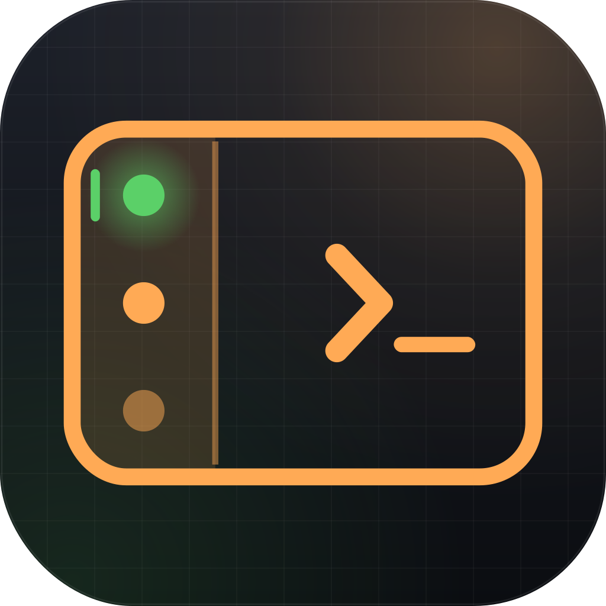
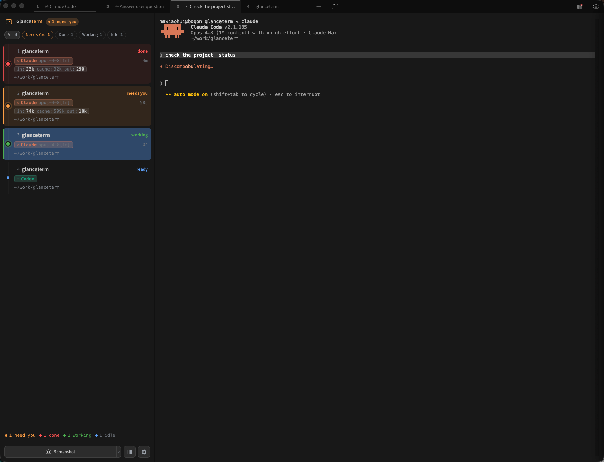

<p align="center">
  
</p>

<h1 align="center">GlanceTerm</h1>

<p align="center">
  <strong>一眼看尽每个 AI agent，绝不错过那个在等你的。</strong>
</p>

<p align="center">
  <strong>并行运行多个 AI 编程 agent</strong> 的终端 ——
  <strong>Claude&nbsp;Code</strong>、<strong>Codex</strong>、<strong>Gemini&nbsp;CLI</strong>、<strong>opencode</strong>。
</p>

<p align="center">
  <a href="LICENSE"></a>
  
  <a href="https://github.com/jessemaxh/GlanceTerm/releases/latest"></a>
  
</p>

<p align="center">
  <a href="README.md">English</a>&nbsp;·&nbsp;简体中文
</p>

---

<p align="center">
  
</p>

同时开着 5+ 个 **Claude Code / Codex / Gemini / opencode** 会话?别再 Cmd-Tab 一个个翻、
盯着标题栏猜哪个跑完了。GlanceTerm 把每个标签页放进一个 **实时状态侧栏** ——
🟢 工作中 · 🔵 完成待你 · 🟠 需要授权 —— **点一下就跳到那个在等你的标签页**。

## ✨ 亮点

- 🟢 **每个标签页实时状态** —— 工作中 / 完成 / 等你,来自每个 agent **自己的 hook 事件**(不轮询、不抓屏、零误判)
- 🎯 **点击即跳** 到正在等你的那个标签页
- 🔄 **重启不丢** —— 重开后每个 agent 恢复到它**之前那个**会话(`claude --resume`、`codex resume`、`opencode --session`)
- 🤖 **多 agent** —— Claude Code 一等公民且已测试;Codex / Gemini CLI / opencode 也有 adapter
- 🧩 **零工作流改动** —— 照样敲 `claude`,hook 首次启动自动装
- 📊 **Token 用量** —— in / cache / out 按 agent · 会话 · 项目拆分,支持 CSV 导出
- 🛡️ **可选自动批准**(有审计日志,**默认关**)· 📸 **截图直接粘给 agent** · 旁边开 shell

```
┌────────────────┬──────────────────────────────────┐
│  AI TABS       │   you@host ~/work/api $          │
│ ● ai-backend   │   > what does this function do?  │
│   working      │   ⏺ Reading src/handler.ts…      │
│ ○ ai-frontend  │                                  │
│   ready  •     │                                  │
│ ◐ ai-tests     │                                  │
│   needs you    │                                  │
└────────────────┴──────────────────────────────────┘
```

## 安装

**macOS**(Apple Silicon)—— Homebrew:

```sh
brew install --cask jessemaxh/glanceterm/glanceterm
```

…或从[最新发布版](../../releases/latest)下载**签名 + 公证的 `.dmg`**。

**Linux**(x64)—— 从[最新发布版](../../releases/latest)下载:`.AppImage` · `.deb` · `.rpm` · `.pacman` · `.tar.gz`。

**Windows**(x64)—— 从[最新发布版](../../releases/latest)下载 `…-setup-x64.exe` 或免安装 `.zip`。⚠️ 未签名 → SmartScreen 点 "More info → Run anyway"。

<sub>每个版本都由 CI **自动构建 + 启动冒烟测试** 全三平台。macOS 仅 Apple Silicon;Linux/Windows 是 x64。</sub>

## Agent 支持

**Claude Code 是一等公民、日常使用中验证过。** Codex 的状态检测已验证;Gemini CLI
和 opencode 的 adapter 尚未端到端测试。

| 能力 | Claude&nbsp;Code | Codex | Gemini&nbsp;CLI | opencode |
|---|:---:|:---:|:---:|:---:|
| 实时状态(工作中 / 完成 / 等你) | ✅ | ✅ | 🧪 | 🧪 |
| 自动批准权限 | ✅ | 🧪 | ❌ | ❌ |
| 重启恢复原会话 | ✅ | 🧪 | ❌ | 🧪 |
| 子 agent + 后台任务角标 | ✅ | ❌ | ❌ | ❌ |

**✅ 已测试 · 🧪 已实现但该 agent 上未测 · ❌ 不支持。** 完整逐事件对照见
[docs/feature-matrix.md](docs/feature-matrix.md)。

## 工作原理

每个标签页在 PTY 启动时注入唯一的 `GLANCETERM_TAB_ID`,`claude`(及其他)都继承它。
首次启动时 GlanceTerm 往 agent 的配置里装一个轻量 **hook**,在每个生命周期事件把一个
JSON 状态文件写到 `~/.glanceterm/hooks/<tab-id>`。侧栏监视该目录、实时刷新每个标签页的
状态 —— **不轮询、不抓屏、零误判。**

## ⚠️ 自动批准(可选,危险)

GlanceTerm 能替你对每个 Claude Code 权限请求自动回 `allow` —— 看管很多 agent 时省事。
**默认关。** 开启后 Claude 可以**不问就执行任何命令** —— 包括 `rm -rf`、`curl … | sh`。

- 每次自动批准都记到 `~/.glanceterm/auto-approve.log`;用侧栏盾牌图标切换,或用
  `~/.glanceterm/auto-approve.flag` 文件做急停开关。
- **别在**主仓库、有凭证的目录、或 `sudo` 免密的 shell 里开。用容器 / 临时目录 / 一次性 VM。

## 与其他工具对比

| | GlanceTerm | HiveTerm | Agent&nbsp;Deck |
|--|--|--|--|
| 形态 | GUI 终端 + 侧栏 | GUI 终端 + 分屏 | tmux + TUI |
| 配置 | 打开 app、允许装 hook | 装 app + 写 `hive.yml` | 每个会话 `agent-deck add` |
| 工作流改动 | **无** —— 照样敲 `claude` | 要学新布局 | 每个会话都得用工具启动 |
| 价格 | **免费,MIT** | $99/年 Pro | 免费 |

## 从源码构建

前置:Node 22、[yarn](https://yarnpkg.com)。

```bash
cd glanceterm && yarn && npm run build
cd tabby-plugin-ai-sidebar && npm install && npm run build
cd .. && ./dev.sh        # 用 :9222 远程调试启动 fork
```

## 致谢

基于 Eugene Pankov 的 [Tabby](https://github.com/Eugeny/tabby) 构建。MIT 协议(同 Tabby)
—— 见 [LICENSE](LICENSE) 和 [NOTICE](NOTICE)。fork 里加的 `SidebarProvider` 扩展点计划上游。
